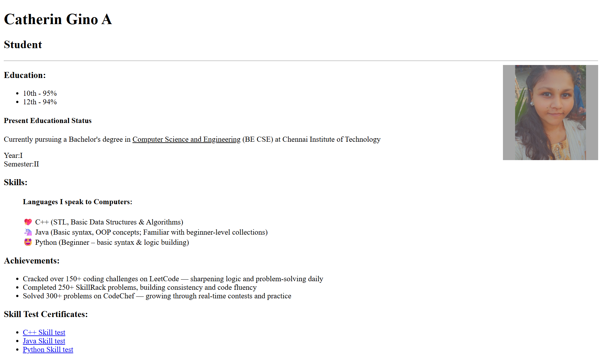

# 📄 My Online Resume

A clean and responsive **HTML resume** that highlights my education, skills, achievements, and certifications.

🌟 **Live Resume:** [catheringino.github.io/My-Resume](https://catheringino.github.io/My-Resume/)

---

## 📸 Preview


---

## ✨ Features
- 🏫 **Education** section with academic details
- 💻 **Skills** categorized by programming languages
- 🏆 **Achievements** showcasing coding milestones
- 📜 **Skill Certificates** with clickable links
- 📱 Fully responsive layout for desktop and mobile
- 📷 Profile picture and personal introduction

---

## 🛠️ Built With
- **HTML5** – Page structure
- **CSS3** – Styling and layout

---

## 🚀 Getting Started
To view the resume locally:
```bash
# Clone the repository
git clone https://github.com/CatherinGino/My-Resume.git

# Open the folder
cd My-Resume

# Open index.html in your browser
